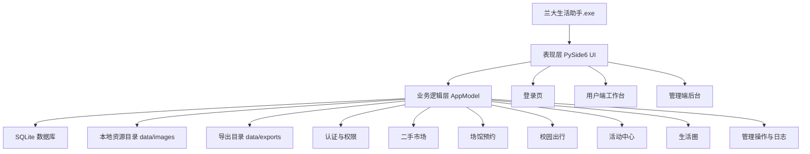
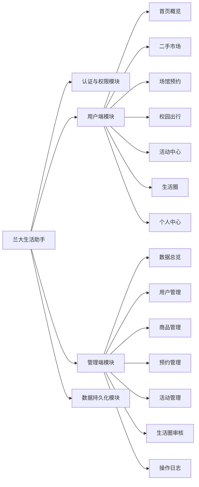
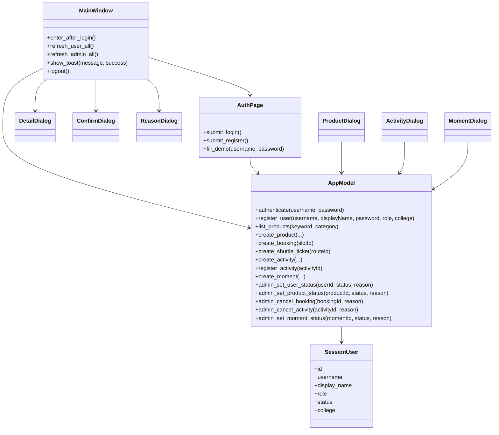
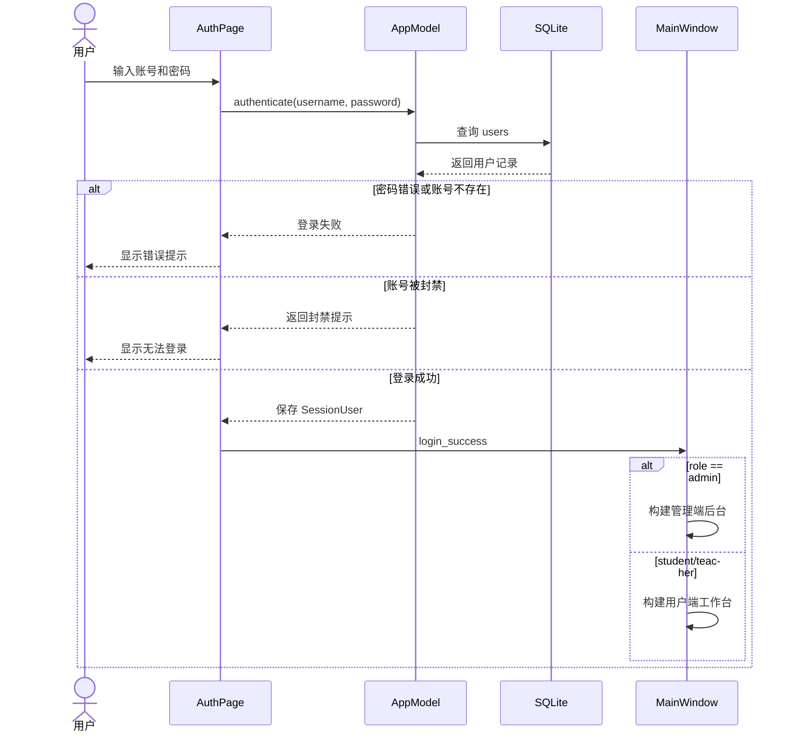
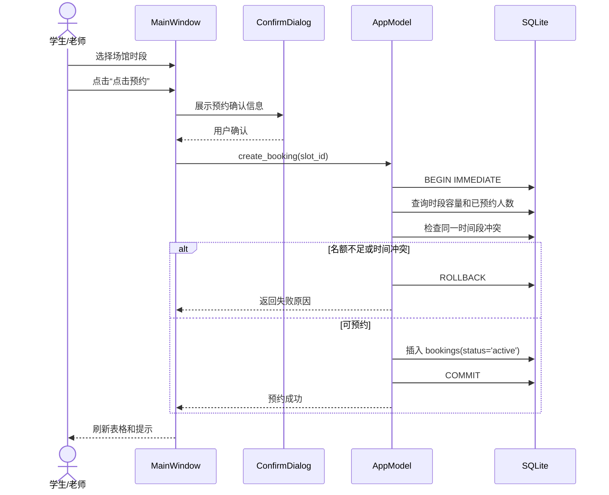
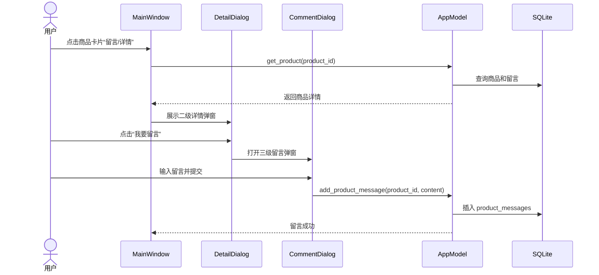
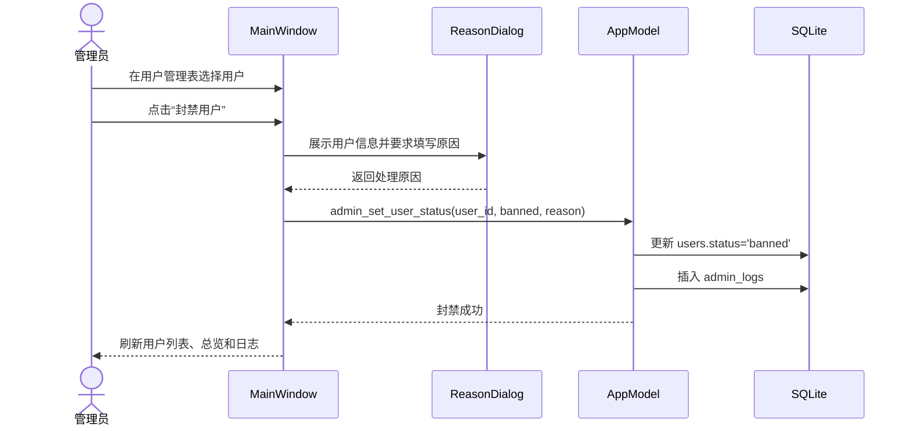
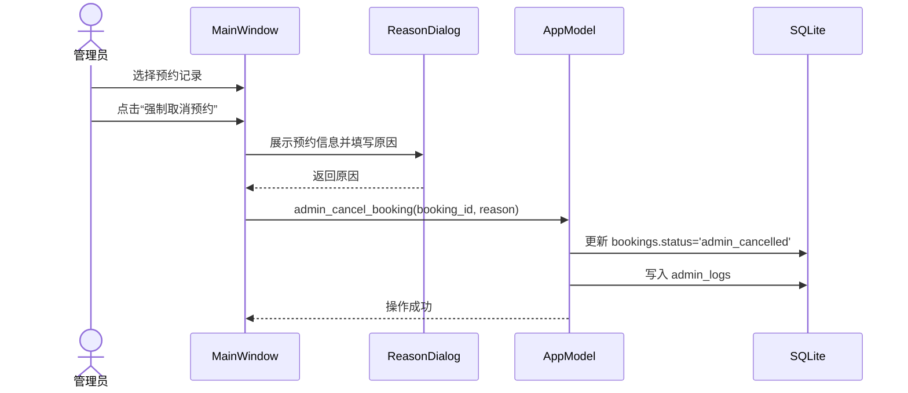
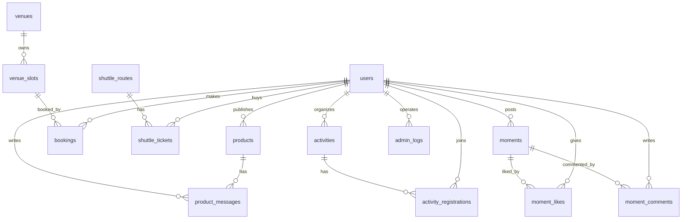

# 兰大生活助手完整设计说明书

## 1. 引言

### 1.1 编写目的

本文档用于说明“兰大生活助手”桌面应用的总体架构、设计类、业务交互流程、数据库设计、类与接口设计以及关键模块详细设计。文档面向课程作业验收、系统开发维护和后续功能扩展，重点说明系统如何从需求规格转化为可运行的软件设计。

### 1.2 项目背景

兰州大学校园日常服务涉及二手交易、场馆预约、校车出行、活动报名、生活圈交流等多个场景。传统方式中，学生和老师需要通过不同渠道获取信息，存在入口分散、数据不统一、管理缺少留痕等问题。

本项目设计并实现一个“兰大生活助手”桌面软件，采用单机桌面部署方式，用户可直接双击可执行文件运行。系统分为用户端和管理端：学生、老师通过用户端完成校园生活服务；管理员通过管理端查看系统数据、封禁用户、下架商品、强制取消预约、取消活动和审核动态。

### 1.3 设计目标

1. 实现课程作业可验收的一键运行软件，降低部署和演示复杂度。
2. 支持学生、老师、管理员三类角色，并根据角色自动进入不同工作台。
3. 覆盖二手市场、场馆预约、校园出行、活动中心、生活圈和个人中心等核心功能。
4. 管理端支持用户管理、商品管理、预约管理、活动管理、生活圈审核和操作日志。
5. 使用 SQLite 实现本地数据持久化，保证离线演示稳定。
6. 采用状态字段表达封禁、下架、取消、删除等操作，避免物理删除导致数据不可追溯。

## 2. 架构设计方案与技术栈

### 2.1 架构选型

本系统是课程作业交付项目，优先考虑“老师双击即可运行”和“无复杂前置环境”。因此不采用需要启动服务器、安装数据库或配置 Docker 的 Web 分布式架构，而采用单机桌面应用架构。

系统采用三层架构：

1. 表现层：PySide6 桌面 UI，负责登录、导航、页面展示、弹窗交互和用户输入。
2. 业务逻辑层：AppModel 统一封装认证、权限、业务校验、状态流转和管理操作。
3. 数据持久层：SQLite 数据库保存用户、商品、预约、校车、活动、动态和日志数据。



### 2.2 技术栈清单

| 层次 | 技术 | 用途 |
|---|---|---|
| 桌面 UI | PySide6 / Qt Widgets | 构建登录页、用户端、管理端、弹窗、表格和卡片 |
| 样式 | QSS | 统一兰大蓝视觉风格、按钮、表格、卡片、状态标签 |
| 业务语言 | Python 3.13 | 实现业务逻辑和数据访问 |
| 数据库 | SQLite | 本地持久化，无需安装独立数据库服务 |
| 密码处理 | SHA-256 哈希 | 保存密码摘要，避免明文存储 |
| 文件处理 | pathlib / shutil | 图片复制、报名名单导出 |
| 打包 | PyInstaller | 生成 Windows 可执行文件 |
| 交付形式 | dist/兰大生活助手.exe | 双击运行 |

### 2.3 部署方案

课程作业交付时，直接提交打包后的 `dist/兰大生活助手.exe`。软件首次运行时会在程序目录下创建或初始化 `data/lzu_lifehelper.db` 数据库，并写入演示数据。

演示账号如下：

| 身份 | 账号 | 密码 |
|---|---|---|
| 学生 | 20230001 | lzu123456 |
| 老师 | teacher01 | lzu123456 |
| 管理员 | admin01 | admin123456 |

## 3. 功能模块概要设计

### 3.1 模块划分



### 3.2 用户端功能说明

| 模块 | 主要功能 |
|---|---|
| 首页概览 | 展示在售商品数、我的预约数、校车票数、已报名活动数，以及最新商品和近期活动 |
| 二手市场 | 商品浏览、分类筛选、发布商品、查看商品详情、留言 |
| 场馆预约 | 查看未来时段、查看余量、确认预约、取消个人预约 |
| 校园出行 | 查看校车线路、余座、确认购票、查看个人车票 |
| 活动中心 | 浏览活动、查看活动详情、报名活动、老师发布活动、导出报名名单 |
| 生活圈 | 发布动态、浏览动态、查看详情、点赞、评论 |
| 个人中心 | 查看个人资料、预约记录、车票记录、修改密码 |

### 3.3 管理端功能说明

| 模块 | 主要功能 |
|---|---|
| 数据总览 | 展示用户总数、今日预约、在售商品、动态数量和场馆预约热度柱状图 |
| 用户管理 | 查看用户列表、封禁用户、解封用户、记录操作原因 |
| 商品管理 | 查看商品详情、下架商品、恢复商品 |
| 预约管理 | 查看全部预约、强制取消异常预约 |
| 活动管理 | 查看活动详情、取消活动、导出报名名单 |
| 生活圈审核 | 查看动态详情、删除动态、恢复动态 |
| 操作日志 | 查看管理员执行过的后台操作 |

## 4. 设计类识别

根据边界类、控制类、实体类的划分方法，系统设计类如下。

### 4.1 边界类

边界类负责和用户交互，主要位于 `desktop/views.py`。

| 类名 | 类型 | 说明 |
|---|---|---|
| MainWindow | 边界类 | 主窗口，负责登录页、用户端、管理端之间的切换 |
| AuthPage | 边界类 | 登录注册页面 |
| ProductDialog | 边界类 | 商品发布弹窗 |
| ActivityDialog | 边界类 | 活动发布弹窗 |
| MomentDialog | 边界类 | 动态发布弹窗 |
| CommentDialog | 边界类 | 留言/评论弹窗 |
| ConfirmDialog | 边界类 | 二级确认弹窗 |
| ReasonDialog | 边界类 | 管理操作原因填写弹窗 |
| DetailDialog | 边界类 | 商品、活动、动态等详情弹窗 |
| BarChart | 边界类 | 管理端柱状图组件 |

### 4.2 控制类

控制类负责业务流程、权限判断和数据操作，主要位于 `desktop/models.py`。

| 类名 | 类型 | 说明 |
|---|---|---|
| AppModel | 控制类 | 系统核心业务类，负责数据库连接、初始化、认证、业务操作和管理操作 |

AppModel 中的重要方法包括：

| 方法 | 说明 |
|---|---|
| authenticate | 用户登录认证 |
| register_user | 注册学生或老师账号 |
| create_product / list_products | 商品发布与查询 |
| create_booking / cancel_booking | 场馆预约与取消 |
| create_shuttle_ticket | 校车票预订 |
| create_activity / register_activity | 活动发布与报名 |
| create_moment / add_comment / toggle_like | 生活圈发布、评论、点赞 |
| admin_set_user_status | 管理员封禁/解封用户 |
| admin_set_product_status | 管理员下架/恢复商品 |
| admin_cancel_booking | 管理员强制取消预约 |
| admin_cancel_activity | 管理员取消活动 |
| admin_set_moment_status | 管理员删除/恢复动态 |
| log_admin | 记录管理员操作日志 |

### 4.3 实体类

实体类对应数据库表，负责表达系统中的核心业务对象。

| 实体 | 对应表 | 说明 |
|---|---|---|
| User | users | 学生、老师、管理员账号 |
| Product | products | 二手商品 |
| ProductMessage | product_messages | 商品留言 |
| Venue | venues | 场馆 |
| VenueSlot | venue_slots | 场馆可预约时段 |
| Booking | bookings | 场馆预约记录 |
| ShuttleRoute | shuttle_routes | 校车线路 |
| ShuttleTicket | shuttle_tickets | 校车票 |
| Activity | activities | 校园活动 |
| ActivityRegistration | activity_registrations | 活动报名记录 |
| Moment | moments | 生活圈动态 |
| MomentLike | moment_likes | 动态点赞 |
| MomentComment | moment_comments | 动态评论 |
| AdminLog | admin_logs | 管理员操作日志 |

### 4.4 UML 设计类图



## 5. 顺序图建模

### 5.1 登录并按角色进入工作台



### 5.2 场馆预约流程



### 5.3 商品详情与留言流程



### 5.4 管理员封禁用户流程



### 5.5 管理员强制取消预约流程



## 6. 数据库设计

### 6.1 ER 图



### 6.2 数据库表结构设计

#### 6.2.1 users 用户表

| 字段 | 类型 | 约束 | 说明 |
|---|---|---|---|
| id | INTEGER | PK, AUTOINCREMENT | 用户 ID |
| username | TEXT | UNIQUE, NOT NULL | 登录账号 |
| display_name | TEXT | NOT NULL | 显示姓名 |
| password_hash | TEXT | NOT NULL | 密码哈希 |
| role | TEXT | NOT NULL | student / teacher / admin |
| status | TEXT | NOT NULL | active / banned |
| college | TEXT | NOT NULL | 学院或单位 |
| bio | TEXT | NOT NULL | 简介 |
| avatar_color | TEXT | NOT NULL | 头像颜色 |
| created_at | TEXT | NOT NULL | 创建时间 |

#### 6.2.2 products 商品表

| 字段 | 类型 | 约束 | 说明 |
|---|---|---|---|
| id | INTEGER | PK | 商品 ID |
| title | TEXT | NOT NULL | 标题 |
| category | TEXT | NOT NULL | 分类 |
| campus | TEXT | NOT NULL | 校区 |
| price | REAL | NOT NULL | 价格 |
| description | TEXT | NOT NULL | 描述 |
| image_path | TEXT |  | 图片路径 |
| seller_id | INTEGER | FK users.id | 发布人 |
| status | TEXT | NOT NULL | normal / removed |
| created_at | TEXT | NOT NULL | 发布时间 |

#### 6.2.3 product_messages 商品留言表

| 字段 | 类型 | 约束 | 说明 |
|---|---|---|---|
| id | INTEGER | PK | 留言 ID |
| product_id | INTEGER | FK products.id | 商品 ID |
| user_id | INTEGER | FK users.id | 留言用户 |
| content | TEXT | NOT NULL | 留言内容 |
| created_at | TEXT | NOT NULL | 留言时间 |

#### 6.2.4 venues 场馆表

| 字段 | 类型 | 约束 | 说明 |
|---|---|---|---|
| id | INTEGER | PK | 场馆 ID |
| name | TEXT | NOT NULL | 场馆名称 |
| category | TEXT | NOT NULL | 场馆类别 |
| campus | TEXT | NOT NULL | 所属校区 |
| location | TEXT | NOT NULL | 具体位置 |

#### 6.2.5 venue_slots 场馆时段表

| 字段 | 类型 | 约束 | 说明 |
|---|---|---|---|
| id | INTEGER | PK | 时段 ID |
| venue_id | INTEGER | FK venues.id | 场馆 ID |
| slot_date | TEXT | NOT NULL | 日期 |
| slot_time | TEXT | NOT NULL | 时间段 |
| capacity | INTEGER | NOT NULL | 容量 |

#### 6.2.6 bookings 预约表

| 字段 | 类型 | 约束 | 说明 |
|---|---|---|---|
| id | INTEGER | PK | 预约 ID |
| slot_id | INTEGER | FK venue_slots.id | 时段 ID |
| user_id | INTEGER | FK users.id | 预约用户 |
| status | TEXT | NOT NULL | active / cancelled / admin_cancelled |
| created_at | TEXT | NOT NULL | 创建时间 |
| updated_at | TEXT | NOT NULL | 更新时间 |

#### 6.2.7 shuttle_routes 校车线路表

| 字段 | 类型 | 约束 | 说明 |
|---|---|---|---|
| id | INTEGER | PK | 线路 ID |
| route_name | TEXT | NOT NULL | 线路名称 |
| from_campus | TEXT | NOT NULL | 出发校区 |
| to_campus | TEXT | NOT NULL | 到达校区 |
| station | TEXT | NOT NULL | 乘车点 |
| departure_time | TEXT | NOT NULL | 发车时间 |
| base_capacity | INTEGER | NOT NULL | 基础座位数 |
| status | TEXT | NOT NULL | normal / disabled |

#### 6.2.8 shuttle_tickets 校车票表

| 字段 | 类型 | 约束 | 说明 |
|---|---|---|---|
| id | INTEGER | PK | 车票 ID |
| route_id | INTEGER | FK shuttle_routes.id | 线路 ID |
| user_id | INTEGER | FK users.id | 购票用户 |
| ride_date | TEXT | NOT NULL | 乘车日期 |
| status | TEXT | NOT NULL | active / cancelled |
| created_at | TEXT | NOT NULL | 购票时间 |

#### 6.2.9 activities 活动表

| 字段 | 类型 | 约束 | 说明 |
|---|---|---|---|
| id | INTEGER | PK | 活动 ID |
| title | TEXT | NOT NULL | 活动标题 |
| category | TEXT | NOT NULL | 活动分类 |
| organizer_id | INTEGER | FK users.id | 组织者 |
| location | TEXT | NOT NULL | 活动地点 |
| start_time | TEXT | NOT NULL | 开始时间 |
| capacity | INTEGER | NOT NULL | 人数上限 |
| summary | TEXT | NOT NULL | 活动简介 |
| status | TEXT | NOT NULL | normal / cancelled |
| created_at | TEXT | NOT NULL | 发布时间 |

#### 6.2.10 activity_registrations 活动报名表

| 字段 | 类型 | 约束 | 说明 |
|---|---|---|---|
| id | INTEGER | PK | 报名 ID |
| activity_id | INTEGER | FK activities.id | 活动 ID |
| user_id | INTEGER | FK users.id | 报名用户 |
| status | TEXT | NOT NULL | active / cancelled |
| created_at | TEXT | NOT NULL | 报名时间 |

#### 6.2.11 moments 生活圈动态表

| 字段 | 类型 | 约束 | 说明 |
|---|---|---|---|
| id | INTEGER | PK | 动态 ID |
| user_id | INTEGER | FK users.id | 发布人 |
| category | TEXT | NOT NULL | 分类 |
| content | TEXT | NOT NULL | 内容 |
| image_path | TEXT |  | 图片路径 |
| status | TEXT | NOT NULL | normal / removed |
| created_at | TEXT | NOT NULL | 发布时间 |

#### 6.2.12 moment_likes 点赞表

| 字段 | 类型 | 约束 | 说明 |
|---|---|---|---|
| id | INTEGER | PK | 点赞 ID |
| moment_id | INTEGER | FK moments.id | 动态 ID |
| user_id | INTEGER | FK users.id | 点赞用户 |
| created_at | TEXT | NOT NULL | 点赞时间 |

#### 6.2.13 moment_comments 评论表

| 字段 | 类型 | 约束 | 说明 |
|---|---|---|---|
| id | INTEGER | PK | 评论 ID |
| moment_id | INTEGER | FK moments.id | 动态 ID |
| user_id | INTEGER | FK users.id | 评论用户 |
| content | TEXT | NOT NULL | 评论内容 |
| status | TEXT | NOT NULL | normal / removed |
| created_at | TEXT | NOT NULL | 评论时间 |

#### 6.2.14 admin_logs 管理员操作日志表

| 字段 | 类型 | 约束 | 说明 |
|---|---|---|---|
| id | INTEGER | PK | 日志 ID |
| admin_id | INTEGER | FK users.id | 管理员 ID |
| action | TEXT | NOT NULL | 操作名称 |
| target_type | TEXT | NOT NULL | 操作对象类型 |
| target_id | INTEGER | NOT NULL | 操作对象 ID |
| detail | TEXT | NOT NULL | 操作详情和原因 |
| created_at | TEXT | NOT NULL | 操作时间 |

### 6.3 建表 SQL 摘要

完整建表逻辑位于 `desktop/models.py` 的 `_create_tables()` 方法。核心 SQL 设计采用 `CREATE TABLE`、外键约束、唯一约束和状态枚举检查约束，例如：

```sql
CREATE TABLE users (
    id INTEGER PRIMARY KEY AUTOINCREMENT,
    username TEXT NOT NULL UNIQUE,
    display_name TEXT NOT NULL,
    password_hash TEXT NOT NULL,
    role TEXT NOT NULL CHECK(role IN ('student', 'teacher', 'admin')),
    status TEXT NOT NULL DEFAULT 'active' CHECK(status IN ('active', 'banned')),
    college TEXT NOT NULL,
    bio TEXT NOT NULL,
    avatar_color TEXT NOT NULL,
    created_at TEXT NOT NULL
);
```

## 7. 类与接口设计

### 7.1 表现层类设计

#### 7.1.1 MainWindow

MainWindow 是系统主窗口，负责维护根级页面栈、用户端导航栈和管理端导航栈。

| 方法 | 功能 |
|---|---|
| enter_after_login | 根据当前登录用户 role 进入用户端或管理端 |
| refresh_user_all | 刷新用户端所有页面数据 |
| refresh_admin_all | 刷新管理端所有页面数据 |
| show_toast | 显示右上角提示 |
| logout | 退出登录并返回登录页 |

#### 7.1.2 AuthPage

AuthPage 负责登录、注册和演示账号快捷填入。

| 方法 | 功能 |
|---|---|
| submit_login | 调用 AppModel.authenticate 完成认证 |
| submit_register | 注册学生或老师账号 |
| fill_demo | 填入演示账号密码 |

#### 7.1.3 Dialog 类

| 类名 | 功能 |
|---|---|
| ProductDialog | 发布商品 |
| ActivityDialog | 发布活动 |
| MomentDialog | 发布动态 |
| CommentDialog | 输入留言或评论 |
| ConfirmDialog | 对预约、购票、导出等操作进行确认 |
| ReasonDialog | 管理员执行敏感操作前填写原因 |
| DetailDialog | 商品、活动、动态的二级详情展示 |

### 7.2 业务控制类设计

#### 7.2.1 AppModel

AppModel 是系统唯一的业务控制类，负责：

1. 初始化数据库和演示数据。
2. 维护当前登录用户 SessionUser。
3. 执行用户端业务，如发布商品、预约场馆、报名活动。
4. 执行管理端业务，如封禁、下架、强制取消和写操作日志。
5. 提供所有页面需要的数据查询接口。

主要接口如下：

| 接口 | 参数 | 返回值 | 异常/规则 |
|---|---|---|---|
| authenticate | username, password | (bool, message) | 账号不存在、密码错误、账号封禁 |
| register_user | username, display_name, password, role, college | (bool, message) | 只允许注册 student/teacher |
| create_product | title, category, campus, price, description, image_path | (bool, message) | 价格必须为数字 |
| create_booking | slot_id | (bool, message) | 检查容量和时间冲突 |
| create_shuttle_ticket | route_id | (bool, message) | 同一班次当天不能重复购票 |
| create_activity | title, category, location, start_time, capacity, summary | (bool, message) | 仅 teacher/admin 可发布 |
| register_activity | activity_id | (bool, message) | 检查重复报名和容量 |
| create_moment | category, content, image_path | (bool, message) | 内容不能为空 |
| admin_set_user_status | user_id, status, reason | (bool, message) | 仅 admin，不能封禁自己 |
| admin_set_product_status | product_id, status, reason | (bool, message) | 写入 admin_logs |
| admin_cancel_booking | booking_id, reason | (bool, message) | 仅 active 可取消 |
| admin_cancel_activity | activity_id, reason | (bool, message) | 已取消活动不可重复取消 |
| admin_set_moment_status | moment_id, status, reason | (bool, message) | 支持删除和恢复 |

## 8. 详细设计

### 8.1 登录认证详细设计

登录时，界面不要求用户手动选择身份。系统根据账号查询 `users` 表，校验密码哈希和账号状态。

处理规则：

1. 如果账号不存在或密码哈希不匹配，返回“账号或密码错误”。
2. 如果 `users.status = banned`，返回“该账号已被管理员封禁，无法登录”。
3. 如果登录成功，将用户数据保存为 `SessionUser`。
4. MainWindow 根据 `SessionUser.role` 判断进入用户端或管理端。

伪代码：

```python
def authenticate(username, password):
    row = query_user(username)
    if row is None:
        return False
    if row.password_hash != hash_password(password):
        return False
    if row.status == "banned":
        return False
    current_user = SessionUser(row)
    return True
```

### 8.2 权限控制详细设计

系统采用基于角色的权限控制。

| 角色 | 权限 |
|---|---|
| student | 浏览、发布商品、预约场馆、购票、报名活动、发布动态、评论点赞 |
| teacher | 拥有普通用户功能，并可发布活动、导出活动报名名单 |
| admin | 进入管理端，执行用户、商品、预约、活动、动态审核和日志查看 |

权限校验主要在业务层执行，而不是只依赖 UI 隐藏按钮。例如发布活动时：

```python
if user.role not in {"teacher", "admin"}:
    return False, "只有老师或管理员可以发布活动"
```

### 8.3 二手市场详细设计

二手市场采用“卡片列表 + 详情弹窗 + 留言弹窗”的三级交互。

1. 列表页展示商品图片、标题、价格、分类、校区和卖家。
2. 点击“留言/详情”打开 DetailDialog。
3. DetailDialog 展示商品元信息、描述和历史留言。
4. 点击“我要留言”打开 CommentDialog。
5. 提交后写入 product_messages 表。

状态规则：

| 状态 | 含义 |
|---|---|
| normal | 正常展示 |
| removed | 管理员下架，不在用户端展示 |

### 8.4 场馆预约详细设计

场馆预约需要处理容量和时间冲突，因此使用事务控制。

处理步骤：

1. 用户选择 venue_slots 中的时段。
2. 系统弹出 ConfirmDialog 展示预约信息。
3. AppModel 开启 `BEGIN IMMEDIATE` 事务。
4. 查询该时段已预约人数。
5. 查询用户是否在同一日期和同一时段已有预约。
6. 若容量足够且无冲突，则插入 bookings。
7. 成功后刷新可预约时段和我的预约。

异常处理：

| 异常 | 处理 |
|---|---|
| 时段不存在 | 返回错误 |
| 名额不足 | 返回“该时段已约满” |
| 时间冲突 | 返回“你在该时间段已有其他预约” |
| 数据库异常 | 回滚事务 |

### 8.5 校园出行详细设计

校园出行模块用于展示校车线路和余座。

1. 查询 shuttle_routes 中状态为 normal 的线路。
2. 根据当天 shuttle_tickets 统计已购票数量。
3. 余座 = base_capacity - booked_count。
4. 购票前弹出 ConfirmDialog。
5. 同一用户同一天同一班次不能重复购票。

### 8.6 活动中心详细设计

活动中心支持老师发布、用户报名和名单导出。

发布规则：

1. 只有 teacher 和 admin 可以发布活动。
2. 人数上限必须为正整数。
3. 活动初始状态为 normal。

报名规则：

1. 报名前先打开活动详情弹窗。
2. 用户确认后检查活动状态。
3. 检查是否已经报名。
4. 检查报名人数是否达到 capacity。
5. 插入 activity_registrations。

导出规则：

1. 导出前弹出确认框。
2. 系统生成 CSV 文件。
3. 文件保存到 `data/exports`。

### 8.7 生活圈详细设计

生活圈支持动态发布、点赞和评论。

1. 用户发布动态时选择分类并填写内容。
2. 动态状态默认为 normal。
3. 用户点击评论时先查看详情，再进入评论弹窗。
4. 点赞通过 moment_likes 表记录，并通过唯一约束避免重复点赞。
5. 管理员可将动态状态改为 removed。

### 8.8 管理端详细设计

管理端所有敏感操作均不直接删除数据，而是修改状态并写操作日志。

| 操作 | 状态变化 | 日志 |
|---|---|---|
| 封禁用户 | users.status active -> banned | 写入 admin_logs |
| 解封用户 | users.status banned -> active | 写入 admin_logs |
| 下架商品 | products.status normal -> removed | 写入 admin_logs |
| 恢复商品 | products.status removed -> normal | 写入 admin_logs |
| 强制取消预约 | bookings.status active -> admin_cancelled | 写入 admin_logs |
| 取消活动 | activities.status normal -> cancelled | 写入 admin_logs |
| 删除动态 | moments.status normal -> removed | 写入 admin_logs |
| 恢复动态 | moments.status removed -> normal | 写入 admin_logs |

管理操作流程：

1. 管理员在表格选择记录。
2. 点击操作按钮。
3. ReasonDialog 展示对象信息并要求填写原因。
4. AppModel 执行状态更新。
5. AppModel 调用 log_admin 写入 admin_logs。
6. UI 刷新表格、数据总览和日志。

### 8.9 操作留痕设计

操作日志表 admin_logs 保存以下信息：

1. 管理员 ID。
2. 操作名称。
3. 操作对象类型。
4. 操作对象 ID。
5. 操作详情和原因。
6. 操作时间。

该设计可以支持课程演示中的“后台权限封禁”“后台取消项目”“后台删除动态”等特殊操作，并能展示系统不是简单删除，而是有状态、有原因、有记录的规范管理。

## 9. 界面设计

### 9.1 视觉规范

系统采用兰州大学特色的深蓝色作为主色，配合青绿色成功色和红色危险色。

| 颜色 | HEX | 用途 |
|---|---|---|
| 主品牌色 | #003B7C | 导航栏、主按钮、选中状态 |
| 辅助生机色 | #00A896 | 成功状态、预约成功、图表 |
| 警示危险色 | #E63946 | 封禁、下架、取消、删除 |
| 背景基色 | #F8F9FA | 窗口背景 |
| 文字主色 | #212529 | 标题和正文 |
| 文字副色 | #6C757D | 次要说明、时间戳 |

### 9.2 布局设计

用户端和管理端均采用“左侧导航栏 + 右侧动态工作区”的布局。左侧用于稳定导航，右侧通过 QStackedWidget 切换页面。

用户端导航：

1. 首页概览
2. 二手市场
3. 场馆预约
4. 校园出行
5. 活动中心
6. 生活圈
7. 个人中心

管理端导航：

1. 数据总览
2. 用户管理
3. 商品管理
4. 预约管理
5. 活动管理
6. 生活圈审核
7. 操作日志

### 9.3 弹窗层级设计

为避免页面过于平铺，系统设计了多层交互：

| 层级 | 用途 | 示例 |
|---|---|---|
| 一级页面 | 列表、概览、筛选 | 商品列表、预约表格 |
| 二级详情弹窗 | 展示对象结构化信息 | 商品详情、活动详情、动态详情 |
| 三级操作弹窗 | 输入内容或确认原因 | 留言、评论、管理操作原因 |

## 10. 异常处理与安全设计

### 10.1 异常处理

| 场景 | 处理方式 |
|---|---|
| 登录失败 | Toast 提示 |
| 账号封禁 | 阻止登录并提示 |
| 预约冲突 | 返回冲突原因 |
| 容量不足 | 阻止预约或报名 |
| 非老师发布活动 | 返回权限错误 |
| 管理员封禁自己 | 阻止操作 |
| 导出失败 | 返回失败提示 |

### 10.2 安全设计

1. 密码不明文保存，使用 SHA-256 摘要保存。
2. 管理操作必须登录管理员账号。
3. 敏感操作使用 ReasonDialog 填写原因。
4. 关键操作不物理删除，使用状态字段标记。
5. 使用 SQLite 外键约束维护数据一致性。

## 11. 物理文件结构

```text
LZU-lifehelper-main/
├─ desktop_app.py                 # 程序入口
├─ desktop/
│  ├─ models.py                   # 数据库、业务逻辑、权限和管理操作
│  ├─ views.py                    # PySide6 界面、页面和弹窗
│  ├─ style.qss                   # 兰大蓝 UI 样式
│  └─ __init__.py
├─ data/
│  ├─ lzu_lifehelper.db            # SQLite 数据库
│  ├─ images/                      # 图片资源
│  └─ exports/                     # CSV 导出目录
├─ scripts/
│  └─ create_shortcut.ps1          # 快捷方式脚本
├─ dist/
│  └─ 兰大生活助手.exe             # 打包后可执行文件
└─ docs/
   └─ 兰大生活助手完整设计说明书.md
```

## 12. 设计总结

本系统根据课程作业“可运行、可展示、可说明”的目标，选择 PySide6 + SQLite + PyInstaller 的单机桌面架构，避免复杂服务部署，保证老师验收时可以直接双击运行。

在设计上，系统按表现层、业务逻辑层、数据持久层分层；按边界类、控制类、实体类识别设计类；按用户端和管理端划分功能模块；使用状态字段和操作日志实现后台管理留痕；通过二级详情弹窗和三级操作弹窗提升界面层次感。

该设计既满足课程作业对架构、类图、顺序图、数据库 ER 图、表结构和详细设计文档的要求，也与当前项目代码实现保持一致，能够支撑完整演示。
